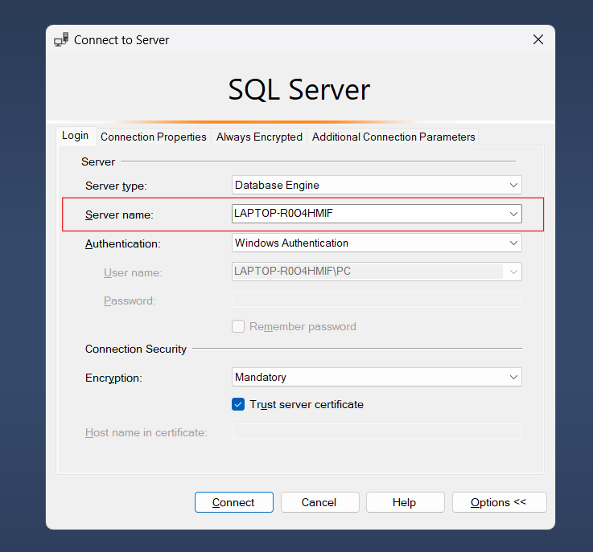
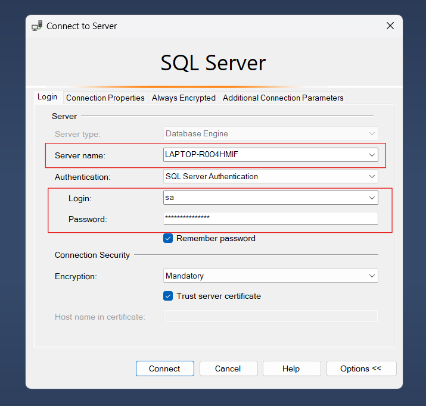

# Directory Permission Management

You are tasked with designing and implementing a permission management system for a directory and file structure across multiple drives in any programming languages. 

Each user can own multiple drives, and each drive can contain multiple folders and files. Each user can be assigned different roles, including:

<b>Admin</b>: Manages the entire system and can share permissions with other users.
<b>Contributor</b>: Can add, modify, and delete folders and files within their assigned scope.
<b>Reader</b>: Has read-only access and cannot perform any modifications.

## Getting Started

The following prerequisites are required to build and run the solution:

- [.NET 8.0 SDK](https://dotnet.microsoft.com/download/dotnet/8.0) (latest version)
- [SQL Server](https://www.microsoft.com/en-us/sql-server/sql-server-downloads)

## Database

Project uses SQL server, you can change any database you want.

#### Connect SQL Server

Please change server name, username, password in file `appsetting.json` > "ConnectionStrings" > "DefaultConnection"

If you use Windows Authentication, you can use this:

```bash
Server=<YourServerName>;Database=DirectoryManagement;Trusted_Connection=True;TrustServerCertificate=True;
```



If you use SQL Server Authentication, you can use this:

```bash
Server=<YourServerName>;Database=DirectoryManagement;Trusted_Connection=True;TrustServerCertificate=True;User Id=<YourUsername>;Password=<YourPassword>
```



#### Create table and initial data

Query or import file `initial-data.sql`

## Run
```bash
git clone github.com/hochitai/Directory-Permission-Management.git
cd Directory-Permission-Management
dotnet run
```

Open browser and paste link `http://localhost:7106/swagger/index.html`


## Technologies

* [ASP.NET Core 8](https://docs.microsoft.com/en-us/aspnet/core/introduction-to-aspnet-core)
* [Entity Framework Core 8](https://docs.microsoft.com/en-us/ef/core/)